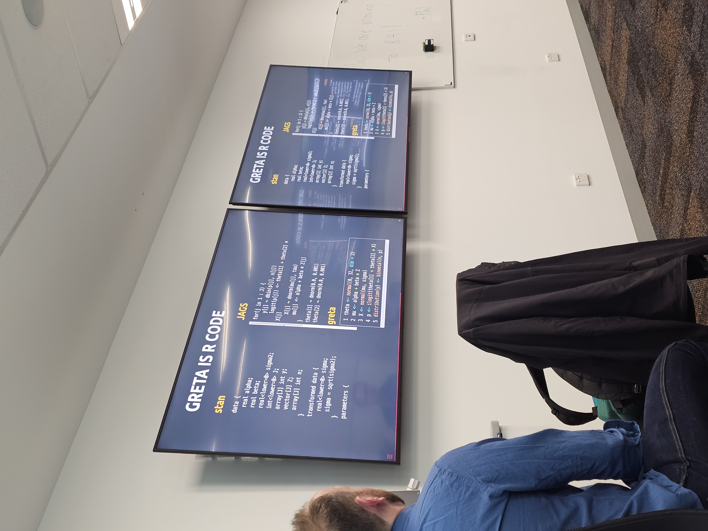

<!-- README.md is generated from README.Rmd. Please edit that file -->

# praiseme

WOMBAT 2025

Very Happy to be volunteer with Nicholas Tierney.

AM Tutorial: [Introduction to R packages!](P1.jpg)

Thank you so much Nick

## Example

``` r
library(praiseme)
praise()
#> Hey Christy, You're so awesome!
praise(name = "Nick, Michael, Fang, Vis, Christy")
#> Hey Nick, Michael, Fang, Vis, Christy, You're so awesome!
```

# Notes for the tutorial

- Creating new project: using New Project -\> New Directory -\> R
  Package using devtools

- Roxgen can use code -\> insert Roxygen skeleton

- Good practice to use devtools::document() to update the documentation

- License: use usethis::use_mit_license & useful link:
  <https://www.tldrlegal.com/>

- 
